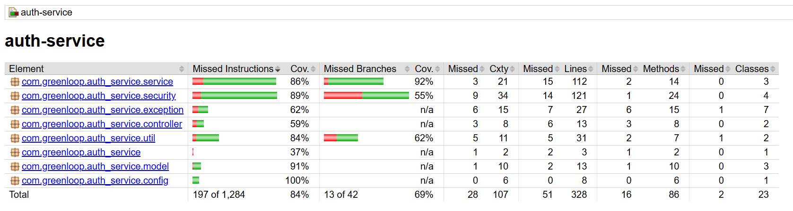

# 🛡️ Auth Service

## 📖 API Documentation

The Auth Service includes **Javadoc-generated API documentation** for all public classes and methods.

* **Location:** [`docs/apidocs/index.html`](https://cs464-recycle-proj.github.io/auth-service/apidocs/index.html)
* **Usage:** View endpoints, method signatures, and comments for developers integrating or contributing to the Auth Service.
* **Example:** Open directly in your browser:

```bash
# From repo root
open docs/apidocs/index.html   # Mac/Linux
start docs\apidocs\index.html  # Windows
```

> 💡 Keep this folder updated by running: `mvn javadoc:javadoc`

---

## 📊 Test Coverage

The project includes comprehensive unit tests with coverage reports.
Current coverage: **84%**



---

## 📘 Description

**auth-service** is a Spring Boot–based microservice responsible for **authentication and authorization**.
It manages secure user registration, login, and **role-based access control (USER / ADMIN)** using **JWT authentication**.

Key features include:

* **Email verification** with OTPs sent via Gmail SMTP
* **Password reset** and account verification tracking
* **Stateless JWT tokens** for sessionless authentication
* **Cookie-based login** with JWT stored in `AUTH_TOKEN` cookie
* **Integration with Gateway Service**, which injects user details in headers for downstream services

**Service Port:** `8081`
**Database:** Supabase – Schema: `authentication`

---

## 🚀 Getting Started

### Prerequisites

* Docker & Docker Compose
* Java 21
* Maven (wrapper included)
* `.env` file with environment variables

### Environment Variables

Create `.env` in the `auth-service` folder:

```env
JWT_SECRET=fake-secret-value
JWT_EXPIRATION_TIME=86400000
JWT_ISSUER=auth-service-issuer
DATABASE_URL=fake-url
DATABASE_PASSWORD=fake-password
DATABASE_USERNAME=postgres.fakeuser
MAIL_HOST=smtp.gmail.com
MAIL_PORT=587
MAIL_USERNAME=fakeemail@gmail.com
MAIL_PASSWORD=fake-app-password
```

---
## ⚙️ Configuration

### Application Properties

* **Server Port:** `server.port=8081`
* **JWT Settings:** Secret, expiration time, and cookie name
* **Database:** Supabase/PostgreSQL connection (from environment variables)
* **Mail (OTP):** SMTP host, port, username, password
* **Actuator:** Health and info endpoints exposed

## 🧪 Testing

```bash
# Run all tests
./mvnw test

# Run tests + generate coverage
./mvnw test jacoco:report

# Run specific test class
./mvnw test -Dtest=JwtUtilTest
```

### Unit Tests

* `AuthServiceTest`
* `VerificationServiceTest`
* `CookieUtilTest`
* `JwtAuthFilterTest`
* `JwtServiceTest`

### Integration Tests

* `AuthControllerTest`
* `VerificationControllerTest`

---

## 🧩 Integration

This service works together with the **Gateway Service**:

* Issues JWT tokens stored in `AUTH_TOKEN` cookies
* Gateway validates JWTs and injects:

  * `X-User-ID`
  * `X-User-Role`
* Other microservices rely on these headers without handling auth directly

---

## 🔄 CI/CD Workflow

### Overview

1. **Build and Test**

   * JDK 21 setup, Maven caching
   * Compile and run unit tests
   * Upload test and coverage reports

2. **Code Quality**

   * Runs **Checkstyle** and **SpotBugs**
   * Performs **SonarCloud** analysis on `main` branch

3. **Docker Build**

   * Builds Docker image `greenloop-auth-service:test`
   * Performs health check with `curl`
   * Pushes image on `main` branch

4. **Security Scans**

   * Uses **Trivy** and **OWASP Dependency Check**
   * Uploads scan reports as artifacts

---

## 🧱 Tech Stack

* **Java 21**
* **Spring Boot 3**
* **Spring Security + JWT**
* **Supabase (PostgreSQL)**
* **Docker-ready**
* **Maven**

---

## ⚙️ Static Analysis

### SpotBugs

```bash
./mvnw spotbugs:gui
./mvnw clean compile spotbugs:check
```

### Checkstyle

```bash
./mvnw checkstyle:check
```

### Javadoc & Coverage

```bash
./mvnw javadoc:javadoc
open target/site/apidocs/index.html

./mvnw clean test jacoco:report
open target/site/jacoco/index.html
```

---

## 📊 Monitoring

**Health Checks**

```bash
curl http://localhost:8081/actuator/health
curl http://localhost:8081/actuator/info
```

**Dockerfile Health Check**

```dockerfile
HEALTHCHECK --interval=30s --timeout=3s --start-period=40s --retries=3 \
  CMD wget --no-verbose --tries=1 --spider http://localhost:8081/actuator/health || exit 1
```

---

## 🧠 Best Practices

* ✅ Cookie-based JWT storage
* ✅ Non-root Docker user
* ✅ Javadoc for all public methods
* ✅ Input validation & null checks
* ✅ Security-first design
* ✅ Code style via Checkstyle

---

## 👥 Contributing

1. Add Javadoc for new classes/methods
2. Write or update unit tests
3. Update README for new features
4. Follow the existing coding style

---

**GreenLoop Auth Service** | Version 1.0 | Java 21 | Spring Boot 3.2.5